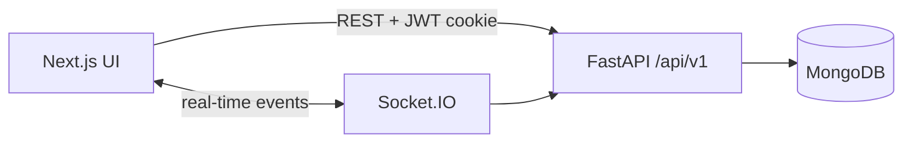

# Architecture

iTools is a monorepo-style workspace with two independent applications: a **FastAPI** backend and a **Next.js** frontend. They share no runtime code; integration happens over HTTP and WebSockets.

## High-level layout

```
iTools/
├── backend/                 # Python API (FastAPI + MongoDB)
├── frontend/                # Next.js 16 App Router UI
├── docs/                    # Product and architecture documentation
├── docker-compose.yml       # Full-stack local deployment
├── .env.example             # Root env template (Docker)
└── README.md
```

## Backend (`backend/`)

Standard FastAPI layout. Each domain has its own route module; shared concerns live under `app/`.

```
backend/
├── app/
│   ├── main.py              # App factory, CORS, Socket.IO mount
│   ├── database.py          # MongoDB connection lifecycle
│   ├── auth.py              # JWT helpers and dependencies
│   ├── config.py            # Settings from environment
│   ├── routes/              # HTTP route handlers (one file per domain)
│   │   ├── auth.py
│   │   ├── users.py
│   │   ├── pipelines.py
│   │   ├── tasks.py
│   │   ├── budgets.py
│   │   ├── communications.py
│   │   ├── notifications.py
│   │   ├── committees.py
│   │   ├── roles.py
│   │   └── system_settings.py
│   └── ...
├── seed.py                  # Database seed (committees, users, roles)
├── requirements.txt
├── Dockerfile
└── .env.example
```

**API base:** `http://localhost:4000/api/v1`

## Frontend (`frontend/`)

Next.js App Router with a **feature-based** module layout. Shared primitives stay in `components/`; domain logic and UI live in `features/`.

```
frontend/
├── app/                     # Routes, layouts, global styles
│   ├── login/
│   ├── register/
│   └── dashboard/           # Authenticated workspace pages
├── components/
│   ├── ui/                  # shadcn/Radix primitives (Button, Dialog, …)
│   ├── patterns/            # Reusable page building blocks (PageTitle, StatCard)
│   ├── brand/               # Logo and brand marks
│   ├── auth/                # Login/register form components
│   ├── dashboard/           # Shared dashboard chrome (breadcrumb, etc.)
│   └── layout/              # App shells (auth layout wrapper)
├── features/                # Domain modules (self-contained)
│   ├── sidebar/             # Dual-rail navigation system
│   │   ├── components/
│   │   ├── hooks/
│   │   ├── services/
│   │   ├── store/
│   │   ├── modules/         # Nav registry entries (itools-modules)
│   │   └── types/
│   ├── kanban/              # Pipeline board + task detail sheet
│   └── members/             # Member management dialogs
├── hooks/                   # App-wide React hooks
├── lib/                     # API client, auth, tokens, utilities
├── public/                  # Static assets (wordmark, icons)
└── scripts/                 # Build-time asset tooling
```

### Import conventions

| Alias | Resolves to | Use for |
|-------|-------------|---------|
| `@/components/ui/*` | Shared UI primitives | Buttons, inputs, dialogs |
| `@/components/patterns` | Page patterns | Headers, stat cards, empty states |
| `@/features/<name>` | Domain modules | Sidebar, kanban, members |
| `@/lib/*` | Utilities and API | `api.ts`, `auth.ts`, `tokens.ts` |

### Sidebar navigation

The sidebar is a self-contained feature under `features/sidebar/`. Navigation items are registered in `features/sidebar/modules/itools-modules.ts` and filtered at runtime by `PermissionService` based on the signed-in user's roles.

## Documentation

| Document | Description |
|----------|-------------|
| [README.md](../README.md) | Setup, Docker, configuration |
| [FRD-PRD.md](./FRD-PRD.md) | Product requirements and module status |

## Data flow


